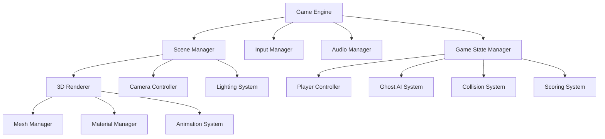

# Design Document

## Overview

The 3D Isometric Pacman game will be built using Three.js as the primary 3D engine, providing cross-platform compatibility through web browsers. The architecture follows a modular design with clear separation between rendering, game logic, input handling, and audio systems. The isometric camera will be positioned at a 45-degree angle to provide optimal visibility of the maze while maintaining the classic Pacman gameplay feel.

## Architecture

### Core Technology Stack
- **3D Engine**: Three.js (WebGL-based 3D library)
- **Language**: TypeScript for type safety and better development experience
- **Build Tool**: Vite for fast development and optimized builds
- **Audio**: Web Audio API with Howler.js for cross-browser compatibility
- **Input**: Native DOM event handling for keyboard input

### System Architecture



## Components and Interfaces

### 1. Game Engine Core

**GameEngine Class**
- Manages the main game loop using requestAnimationFrame
- Coordinates all subsystems (rendering, input, audio, game logic)
- Handles initialization and cleanup
- Maintains target 60 FPS with delta time calculations

**Interface:**
```typescript
interface IGameEngine {
  initialize(): Promise<void>;
  start(): void;
  pause(): void;
  stop(): void;
  update(deltaTime: number): void;
  render(): void;
}
```

### 2. 3D Rendering System

**SceneManager Class**
- Manages Three.js scene, camera, and renderer
- Handles isometric camera positioning and controls
- Manages lighting setup (ambient + directional for shadows)
- Optimizes rendering performance through frustum culling

**Camera Configuration:**
- Position: (20, 20, 20) for optimal isometric view
- Target: Center of maze
- FOV: 45 degrees
- Near/Far planes: 0.1/1000

**Lighting Setup:**
- Ambient light: 0x404040 (soft fill lighting)
- Directional light: 0xffffff positioned at (10, 10, 5) for shadows
- Shadow mapping enabled for depth perception

### 3. Game Objects

**GameObject Base Class**
```typescript
abstract class GameObject {
  position: Vector3;
  rotation: Vector3;
  scale: Vector3;
  mesh: THREE.Mesh;
  
  abstract update(deltaTime: number): void;
  abstract render(): void;
}
```

**Pacman Class**
- Inherits from GameObject
- Handles movement logic and animation
- Manages mouth opening/closing animation
- Collision detection with walls and collectibles

**Ghost Class**
- AI behavior states: Chase, Scatter, Frightened, Dead
- Pathfinding using A* algorithm for maze navigation
- Individual personality traits (aggressive, ambush, random, defensive)
- State transitions based on game events

**Maze Class**
- Procedural generation from 2D array definition
- 3D wall generation with proper texturing
- Pellet and power pellet placement
- Collision mesh generation for physics

### 4. Input System

**InputManager Class**
- Handles keyboard event listeners
- Maintains key state tracking for held keys
- Provides smooth movement through continuous input polling
- Supports key mapping configuration

**Key Mapping:**
- Arrow Keys: Movement (up, down, left, right)
- Space: Pause/Resume
- M: Mute/Unmute audio
- R: Restart game

### 5. Physics and Collision

**CollisionSystem Class**
- Grid-based collision detection for performance
- Bounding box collision for precise detection
- Handles Pacman-wall, Pacman-ghost, and Pacman-pellet interactions
- Optimized spatial partitioning for large mazes

**Movement System:**
- Smooth interpolation between grid positions
- Direction queuing for responsive controls
- Wall sliding for corner navigation
- Speed modulation based on game state

## Data Models

### Game State Model
```typescript
interface GameState {
  score: number;
  lives: number;
  level: number;
  gameStatus: 'playing' | 'paused' | 'gameOver' | 'levelComplete';
  powerModeActive: boolean;
  powerModeTimer: number;
}
```

### Maze Model
```typescript
interface MazeData {
  width: number;
  height: number;
  layout: number[][]; // 0: empty, 1: wall, 2: pellet, 3: power pellet
  pacmanStart: Vector2;
  ghostStarts: Vector2[];
}
```

### Entity Model
```typescript
interface Entity {
  id: string;
  position: Vector3;
  direction: Vector2;
  speed: number;
  state: string;
  mesh: THREE.Mesh;
}
```

## Error Handling

### Resource Loading
- Graceful fallbacks for missing 3D models or textures
- Loading progress indicators with retry mechanisms
- Error logging for debugging failed asset loads

### Runtime Errors
- Try-catch blocks around critical game loop operations
- Automatic pause on critical errors with user notification
- Performance monitoring with automatic quality reduction

### Browser Compatibility
- WebGL capability detection with fallback messaging
- Audio context handling for different browser policies
- Mobile device detection with appropriate UI scaling

## Testing Strategy

### Unit Testing
- Jest framework for testing game logic components
- Mock Three.js dependencies for isolated testing
- Test coverage for collision detection, AI behavior, and scoring

### Integration Testing
- End-to-end gameplay scenarios
- Performance testing under various conditions
- Cross-browser compatibility testing

### Performance Testing
- Frame rate monitoring during gameplay
- Memory usage tracking for leak detection
- Load testing with complex maze configurations

### Visual Testing
- Screenshot comparison for rendering consistency
- Animation smoothness verification
- Lighting and shadow quality checks

## Performance Optimizations

### Rendering Optimizations
- Object pooling for frequently created/destroyed objects (pellets, particles)
- Level-of-detail (LOD) system for distant objects
- Frustum culling to avoid rendering off-screen objects
- Texture atlasing to reduce draw calls

### Memory Management
- Proper disposal of Three.js objects to prevent memory leaks
- Asset preloading with intelligent caching
- Garbage collection optimization through object reuse

### Game Logic Optimizations
- Spatial partitioning for collision detection
- AI pathfinding caching and optimization
- Delta time-based animations for consistent performance

## Asset Requirements

### 3D Models
- Pacman: Animated sphere with mouth opening/closing
- Ghosts: Rounded cube models with eye animations
- Maze walls: Modular wall pieces with proper UV mapping
- Pellets: Simple sphere geometry with glow effect

### Textures
- Wall textures: High-resolution brick or stone patterns
- Character textures: Bright, cartoon-style materials
- Particle effects: Glow maps for power pellets and effects

### Audio Assets
- Background music: Looping retro-style soundtrack
- Sound effects: Pellet collection, power-up, death, ghost eating
- Spatial audio support for directional sound effects

## Deployment Considerations

### Build Configuration
- Vite configuration for optimized production builds
- Asset compression and minification
- Progressive loading for large assets

### Browser Support
- Modern browsers with WebGL support
- Graceful degradation for older browsers
- Mobile responsiveness with touch controls as future enhancement